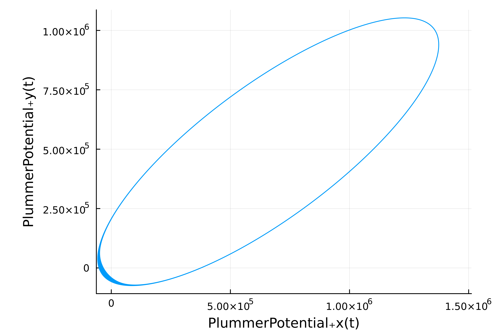

# `GalacticPotentials.jl`

_Common models within galactic dynamics!_

## Overview

This package extends `ModelingToolkit` to represent common galactic
potentials. All available potentials are shown on the [Reference](reference.md)
page.

## Installation

Choose one of the two lines below!

```julia
pkg> GalacticPotentials             # in Julia's REPL
```

```julia
Pkg.add("GalacticPotentials.jl")    # in Julia code
```

## Usage

This package is intended to be used alongside `ModelingToolkit.jl` and the rest
of the [`SciML`](https://sciml.ai) ecosystem. Scalar potential fields within
`gala` and `galpy` -- two popular Python packages for galactic dynamics --
were used to bootstrap this package. All available potential fields are shown
on the [Reference](reference.md) page. See the code block below for a one-click
example of `GalacticPotentials.jl` usage.

```julia
using Plots
using ModelingToolkit
using DifferentialEquations
using GalacticPotentials

let model = PlummerPotential(gradient=true)

    p = @nonamespace Dict(
        model.G => 6.6743e-20, # field strength (km³ kg⁻¹ s⁻²)
        model.m => 6e31,       # mass (kg)
        model.b => 1e-6        # softening parameter (unitless)
    )

    u0 = @nonamespace Dict(
        model.x => 11e5,
        model.y => 5e5,
        model.z => 0,
        model.ẋ => 1e3,
        model.ẏ => 1e3,
        model.ż => 0
    )

    ts = (0.0, 1e6)

    problem = ODEProblem(model, u0, ts, p)
    solution = solve(problem; reltol=1e-14, abstol=1e-14)

    plot(solution; idxs=(:x,:y), label=:none, dpi = 400, aspect_ratio=:equal)
end
```


